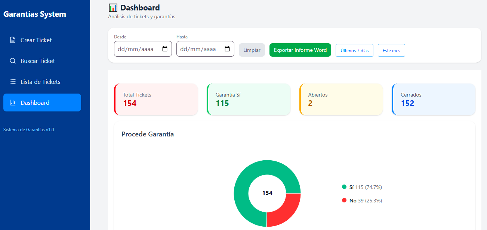
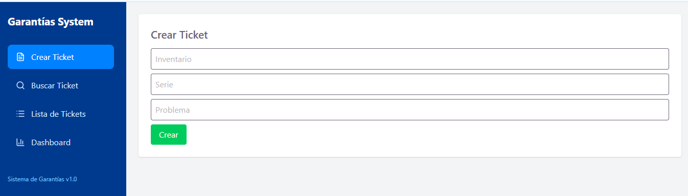
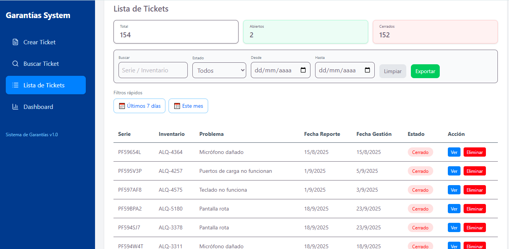
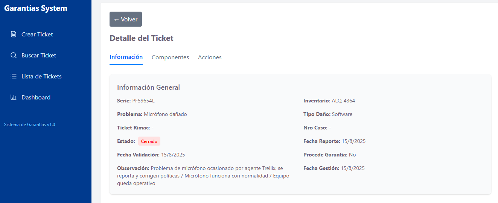
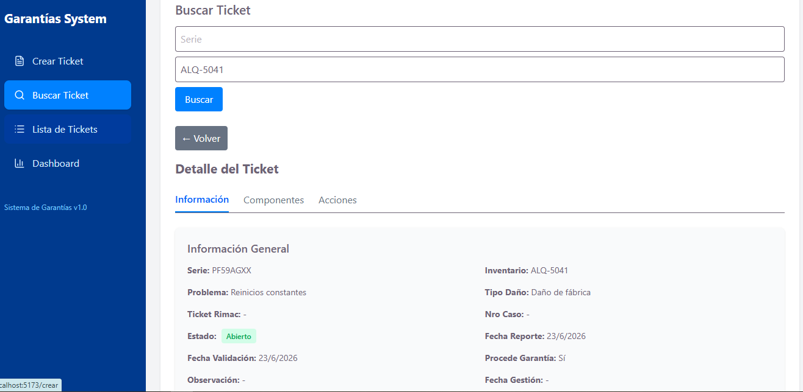
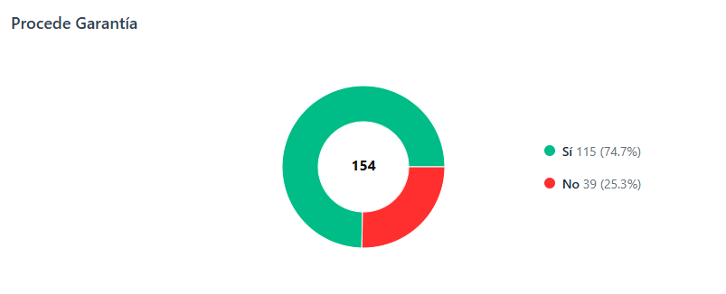
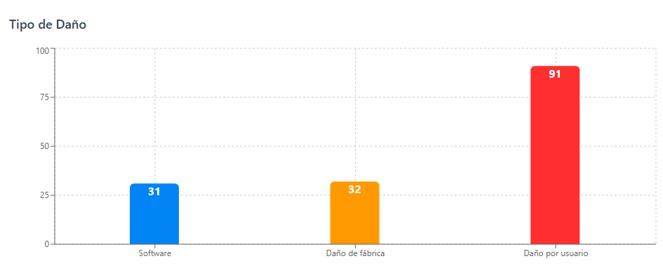
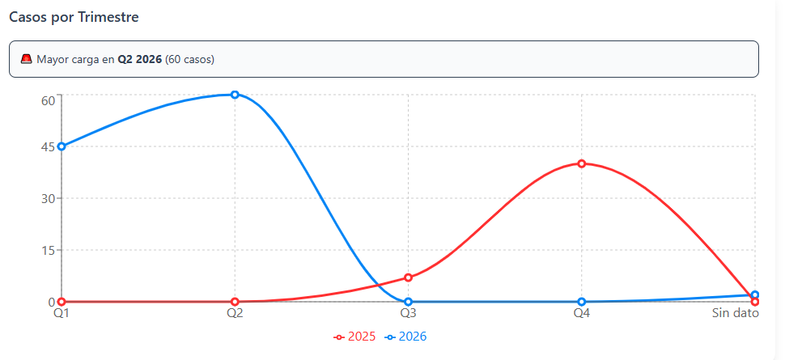
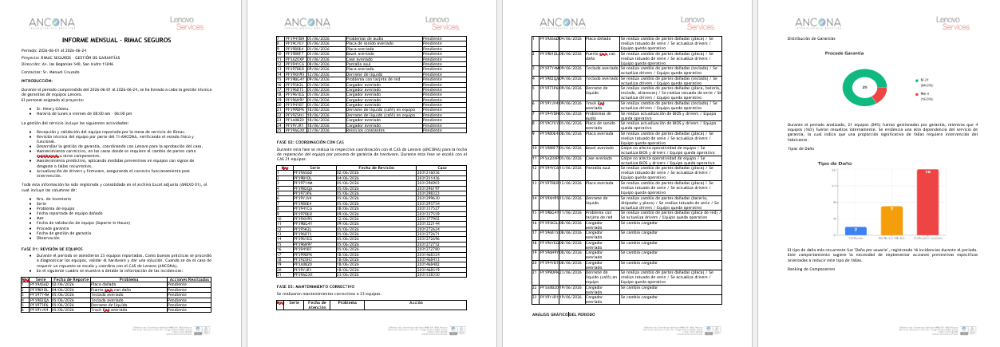

# Sistema de Gestión de Garantías

Repositorio integrador del ecosistema **GarantiasApp**, una solución Full Stack desarrollada para la gestión de garantías de equipos Lenovo, seguimiento de incidencias, control de componentes, análisis operativo mediante dashboards y generación automática de reportes ejecutivos.

Este repositorio centraliza la arquitectura general del proyecto, documentación, capturas, orquestación con Docker Compose y preparación del pipeline QA Automation mediante GitHub Actions.

---

## Descripción General

GarantiasApp permite gestionar el ciclo completo de atención de garantías e incidencias técnicas:

- Registro de tickets de incidencias.
- Búsqueda y seguimiento de tickets.
- Actualización de observaciones, casos y tickets asociados.
- Gestión de componentes reemplazados.
- Control de garantías procedentes y no procedentes.
- Visualización de indicadores operativos mediante dashboards.
- Exportación de reportes ejecutivos en Word y CSV.
- Automatización de pruebas UI, API e híbridas API + UI.

El proyecto está organizado en repositorios independientes para mantener una arquitectura modular, separando responsabilidades entre frontend, backend y QA Automation.

---

## Arquitectura del Ecosistema

```text
GarantiasApp
│
├── Frontend React
│   └── Interfaz de usuario, dashboard, filtros y reportes.
│
├── Backend .NET
│   └── API REST, reglas de negocio y conexión a SQL Server.
│
├── SQL Server
│   └── Persistencia de tickets, garantías y componentes.
│
└── QA Automation
    └── Playwright, Postman, Newman, reportes y dashboard QA.

## Repositorios

### Frontend

🔗 https://github.com/GabiProm/garantias-frontend

Aplicación React con dashboard, filtros y generación de reportes.

### Backend

🔗 https://github.com/GabiProm/garantias-api

API REST desarrollada en ASP.NET Core 8 y SQL Server.

### QA Automation

🔗 https://github.com/GabiProm/garantias-qa

Automatización UI con Playwright y API Testing con Postman/Newman.
---

## 📸 Capturas

### 📊 Dashboard


---

### 📄 Crear Ticket
Apartado para la creación de tickets.



---

### 📄 Lista de Tickets
Apartado para la visualización de tickets creados, así como el detalle de cada uno y su eliminación si es necesario.





---

### 📄 Buscar Tickets
Apartado para la búsqueda de tickets.



---

### 📈 Gráficos









---

### 📄 Reporte Word
Resultado de la generación dinámica de un informe en función de los filtros seleccionados en el dashboard.



---

### 📊 Exportación CSV
Resultado de la exportación de data en función de los filtros aplicados. Incluye resumen, análisis y data completa.


---

## Autor

Henry Gabriel Gómez Gerónimo

Ingeniero Electrónico | Soporte TI N2 | Backend Developer | QA Automation | DevOps Enthusiast